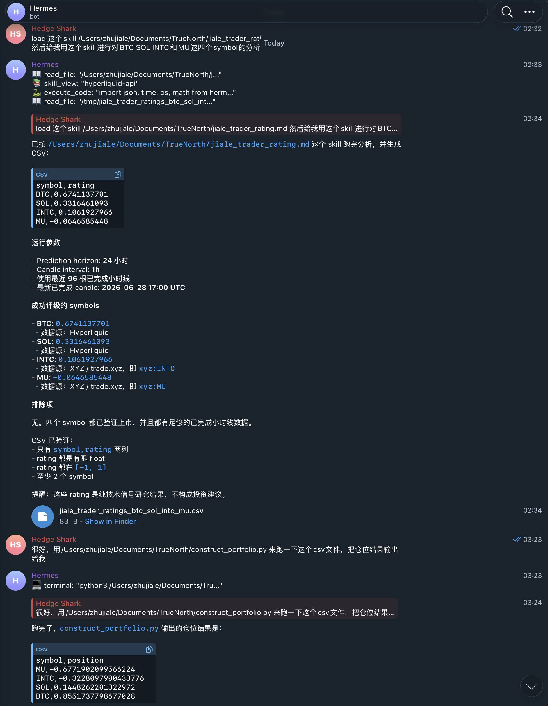

# Portfolio Constructor

Build a market-neutral long/short portfolio from a CSV of symbol ratings.

The script uses only the Python standard library. No pandas or other external packages are required.

## Input Format

Input CSV files must contain exactly the columns needed by the script:

```csv
symbol,rating
AAPL,0.62
BTC,0.81
ETH,0.37
SOL,-0.18
```

Rules:

- `symbol` must be a non-empty string.
- `rating` must be a finite float in `[-1, 1]`.
- At least 2 symbols are required.
- Duplicate symbols are rejected.

## Usage

Print portfolio positions to stdout:

```bash
python3 construct_portfolio.py samples/sample_input_1.csv
```

Write portfolio positions to a CSV file:

```bash
python3 construct_portfolio.py samples/sample_input_1.csv sample_positions_1.csv
```

Generate output files for all included samples:

```bash
mkdir -p outputs
for file in samples/sample_input_*.csv; do
  output="outputs/$(basename "$file" .csv)_positions.csv"
  python3 construct_portfolio.py "$file" "$output"
done
```

## Included Sample Inputs

```bash
python3 construct_portfolio.py samples/sample_input_1.csv
python3 construct_portfolio.py samples/sample_input_2.csv
python3 construct_portfolio.py samples/sample_input_3.csv
```

The sample files cover hot equity and crypto symbols such as `AAPL`, `BTC`, `ETH`, `SOL`, `SPCX`, `CRCL`, `NVDA`, `TSLA`, `MSTR`, `COIN`, `HOOD`, `AVAX`, `LINK`, and `XRP`.

## Generate Ratings With The Skill

Use [jiale_trader_rating.md](jiale_trader_rating.md) when you want an AI agent to generate a fresh `symbol,rating` input file from market data.

Example prompt:

```text
load this skill /Users/zhujiale/Documents/TrueNorth/jiale_trader_rating.md
Then use this skill to analyze BTC, SOL, INTC, and MU.
Generate the portfolio input CSV.
```

The skill asks the agent to verify whether each symbol is listed on Hyperliquid or trade[XYZ], fetch completed hourly candles, compute RSI/MACD/SMI technical ratings, and write a CSV that can be consumed by this portfolio constructor.

Example rating input generated by the skill:

```csv
symbol,rating
BTC,0.6741137701
SOL,0.3316461093
INTC,0.1061927966
MU,-0.0646585448
```

The matching sample files are included here:

```bash
python3 construct_portfolio.py samples/jiale_trader_ratings_btc_sol_intc_mu.csv
python3 construct_portfolio.py samples/jiale_trader_ratings_btc_sol_intc_mu.csv samples/jiale_trader_ratings_btc_sol_intc_mu_output.csv
```

Use-case screenshot:



## Output Format

The output CSV contains:

```csv
symbol,position
AAPL,0.25
BTC,0.75
SOL,-1.0
```

Rules:

- Positive positions sum to `1`.
- Negative positions sum to `-1`.
- Net position sums to `0`.
- Positions may be negative because shorting is allowed.

## Allocation Logic

The script sorts symbols by rating from low to high, computes the mean rating, then:

- Longs symbols with `rating >= mean`.
- Shorts symbols with `rating < mean`.
- Weights longs by `rating - mean`.
- Weights shorts by `mean - rating`.
- Normalizes each side so long exposure is `+1` and short exposure is `-1`.

If all ratings are identical, or if the mean rule creates no short bucket, the script sorts by symbol alphabetically, shorts the last symbol at `-1`, and splits `+1` equally across the remaining symbols.

## Validation And Tests

Run the unit tests:

```bash
python3 -m unittest -v
```

Check the Python files compile:

```bash
python3 -m py_compile construct_portfolio.py test_construct_portfolio.py
```
